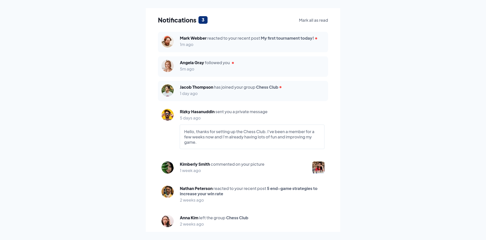

# Frontend Mentor - Notifications page solution

This is a solution to the [Notifications page challenge on Frontend Mentor](https://www.frontendmentor.io/challenges/notifications-page-DqK5QAmKbC). Frontend Mentor challenges help you improve your coding skills by building realistic projects.

## Table of contents

- [Overview](#overview)
  - [Screenshot](#screenshot)
  - [Links](#links)
- [Built with](#built-with)
- [Author](#author)

## Overview

Another good challenge from Frontend Mentor, in which the user can mark all the notifications as read.

I tried building this one using React JS, which I am still learning. It helped me get a hang of state and components.

### Screenshot

### Links

- Solution URL: [https://www.frontendmentor.io/solutions/notifications-page-using-reactjs-Les8mpP-x_](https://www.frontendmentor.io/solutions/notifications-page-using-reactjs-Les8mpP-x_)
- Live Site URL: [https://adrianfloroiu.github.io/notifications-page/](https://adrianfloroiu.github.io/notifications-page/)

## Built with

- React
- HTML5
- CSS
- Flexbox

## Author

- Frontend Mentor - [@adrianfloroiu](https://www.frontendmentor.io/profile/adrianfloroiu)
